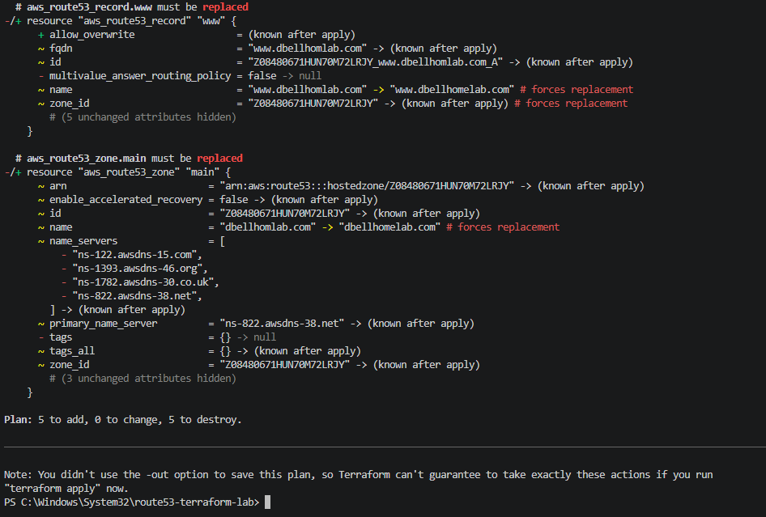
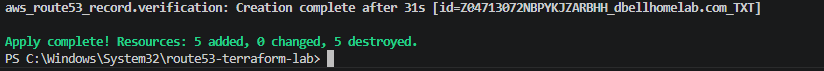
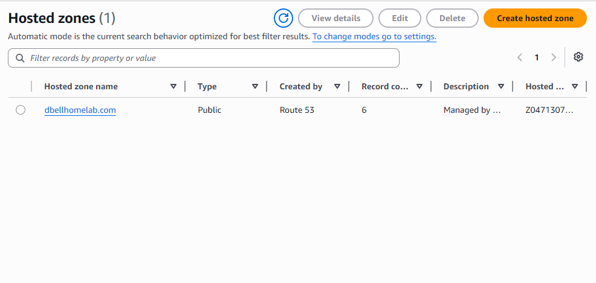
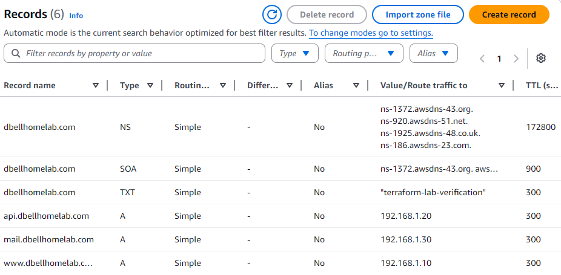

# AWS Route 53 DNS Automation with Terraform

## Project Overview

This project demonstrates Infrastructure as Code (IaC) principles by automating DNS infrastructure deployment in Amazon Route 53 using Terraform.

Instead of manually creating DNS records through the AWS Management Console, all Route 53 resources are defined as code and deployed through Terraform. This approach enables repeatable deployments, version control, and automated infrastructure management.

---

## Objectives

* Learn Terraform fundamentals
* Automate DNS infrastructure deployment
* Gain hands-on experience with AWS Route 53
* Implement Infrastructure as Code workflows
* Practice troubleshooting Terraform and AWS deployment issues
* Publish a cloud networking project to GitHub

---

## Technologies Used

| Technology         | Purpose                       |
| ------------------ | ----------------------------- |
| Terraform          | Infrastructure as Code        |
| AWS Route 53       | DNS Hosting                   |
| AWS CLI            | Authentication and AWS access |
| Git                | Version Control               |
| GitHub             | Source Code Management        |
| Visual Studio Code | Development Environment       |
| PowerShell         | Command Line Management       |

---

## Architecture

DNS infrastructure is deployed through Terraform into AWS Route 53.

```text
Terraform Configuration
         │
         ▼
AWS Provider
         │
         ▼
Route 53 Hosted Zone
         │
 ┌───────┼────────┐
 ▼       ▼        ▼
www      api     mail
A Record A Record A Record

         ▼
TXT Verification Record
```

---

## Terraform Resources Created

### Hosted Zone

* Route 53 Hosted Zone

### DNS Records

* www A Record
* api A Record
* mail A Record
* TXT Verification Record

---

## Deployment Workflow

Initialize Terraform:

```powershell
terraform init
```

Validate Configuration:

```powershell
terraform validate
```

Format Code:

```powershell
terraform fmt
```

Review Deployment Plan:

```powershell
terraform plan
```

Deploy Infrastructure:

```powershell
terraform apply
```

Destroy Infrastructure:

```powershell
terraform destroy
```

---

## Project Structure

```text
route53-terraform-dns-automation
│
├── main.tf
├── variables.tf
├── terraform.tfvars.example
├── README.md
└── .gitignore
```

---

## Challenges Encountered

During implementation several real-world issues were encountered and resolved:

### Windows Permission Issues

Terraform initially failed to create the `.terraform` provider directory due to insufficient permissions.

Resolution:

* Reopened Visual Studio Code with Administrator privileges.

### Route 53 TXT Record Validation

Terraform deployment failed due to incorrect TXT record formatting.

Resolution:

* Corrected TXT record syntax to comply with Route 53 requirements.

### GitHub Large File Rejection

GitHub rejected the initial push because Terraform provider binaries were accidentally included in source control.

Resolution:

* Added Terraform artifacts to `.gitignore`
* Removed provider binaries from Git tracking
* Rebuilt repository history

---

## Skills Demonstrated

* DNS Administration
* Cloud Networking
* AWS Route 53
* Infrastructure as Code
* Terraform
* Git & GitHub
* Troubleshooting
* PowerShell
* Change Management Through Code

---

## Future Enhancements

* Terraform Modules
* Route 53 Health Checks
* Route 53 Failover Routing
* GitHub Actions CI/CD Pipeline
* Multi-Environment Deployments (Dev/Test/Prod)
* DNS Monitoring and Alerting

---

## Screenshots

### Terraform Plan



### Terraform Apply



### Route 53 Hosted Zone



### DNS Records



## Author

De'Ron Bell

Networking and Cloud Infrastructure Professional

GitHub: https://github.com/deronbell214
